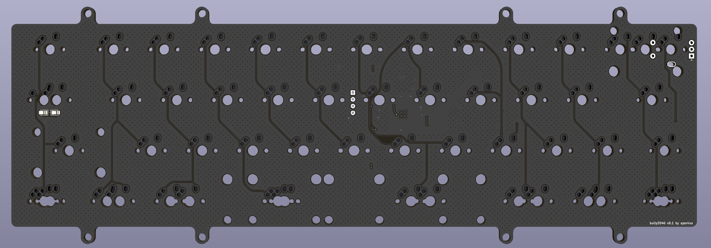
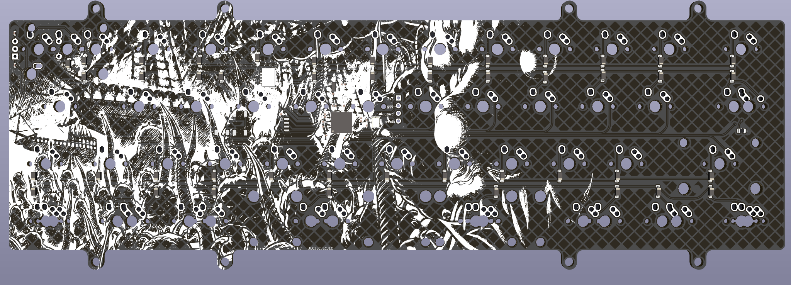

Opensource PCB for bully keyboard
------------------------------

Capactive sensing pcb for [Bully keyboard](https://mkh.works/#bully).

### Features
- stm32F072CB

### Supported layouts

### Production files
JLCPCB [production files](pcb/production) are provided. Component positions have been verified, but as always, do your own diligence when ordering.

### PCB

