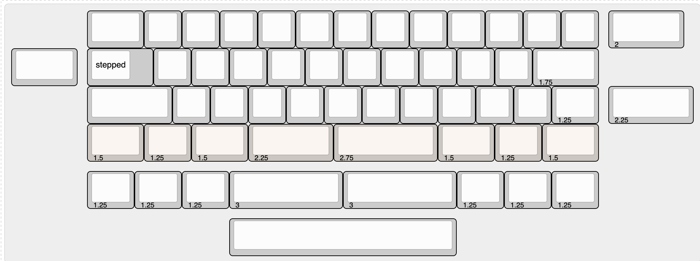

Capybully
---

Open source capactive sensing pcb for [Bully keyboard](https://mkh.works/#bully).

### Status
PCB has been tested and is fully functional with Niz and Deskeys parts.

### Specs
- MCU: stm32F072CB

### Supported layouts
 + 6u

### Production files
JLCPCB [production files](pcb_production) are provided. Component positions have been verified, but as always, do your own diligence when ordering.

#### Firmware
- [See here](./firmware) for instructions, links to qmk/vial config and binaries.

#### Hardware
- 25x m2 brass standoff. 5mm long x 3mm diameter
- 50x m2 low profile screws

## Misc
#### 3D assembly preview
* [online viewer](https://3dviewer.net/#model=https://github.com/sporkus/capybully_keyboard/blob/dev/documentation/capybully-3D.step)
* [step assembly](./documentation/capybully-3D.step)

#### PCB Renders

#### Interactive BoM
Download and open this [html](./documentation/capybully-ibom.html) locally

#### Schematic
[pdf](./documentation/capybully-schematic.pdf)
