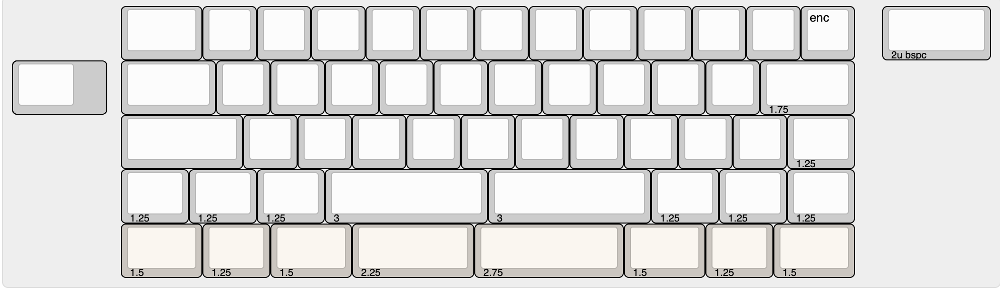
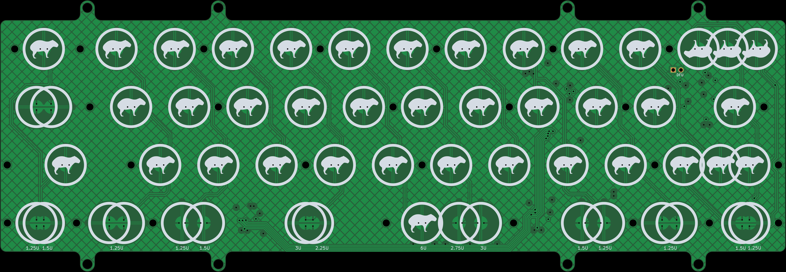
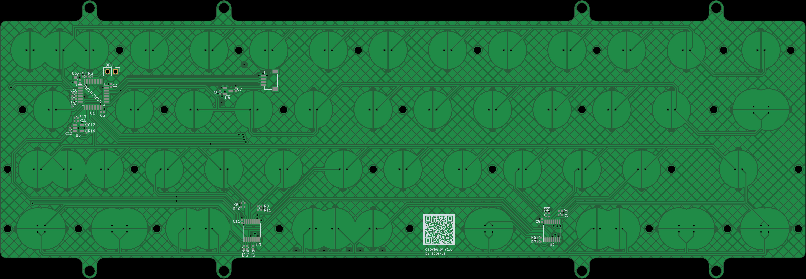

Capybully
---

Open source capactive sensing pcb for [Bully keyboard](https://mkh.works/#bully).

### Status
PCB has been tested and is fully functional. Still finalizing on plate options.

### Specs
- MCU: stm32F072CB

### Supported layouts
 + 6u

### Production files
JLCPCB [production files](pcb_production) are provided. Component positions have been verified, but as always, do your own diligence when ordering.

#### Firmware
- [QMK and vial config](https://github.com/sporkus/qmk_userspace/tree/main/keyboards/sporkus/capybully)

## Misc
#### PCB Renders

#### Interactive BoM
Download and open this [html](./documentation/capybully-ibom.html) locally

#### Schematic
[pdf](./documentation/capybully-schematic.pdf)
